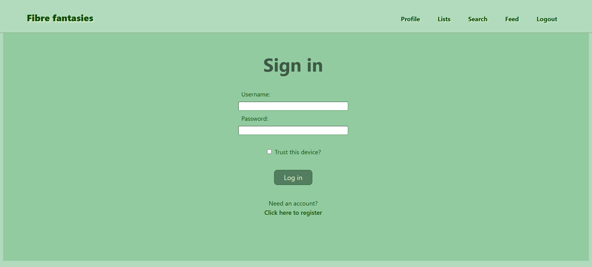
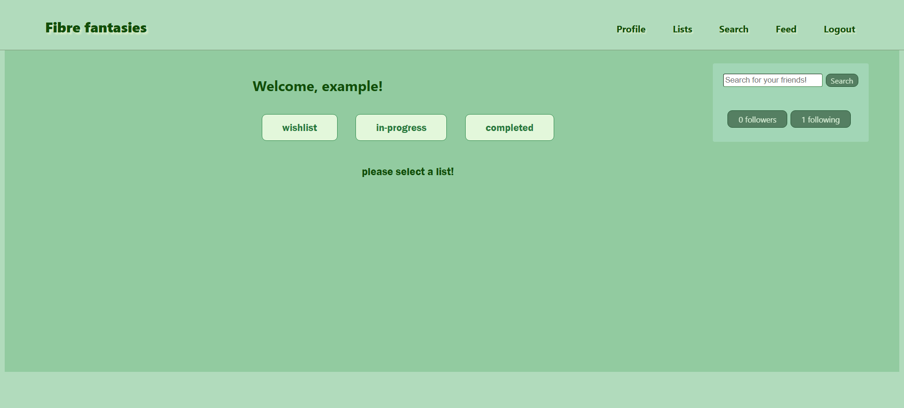
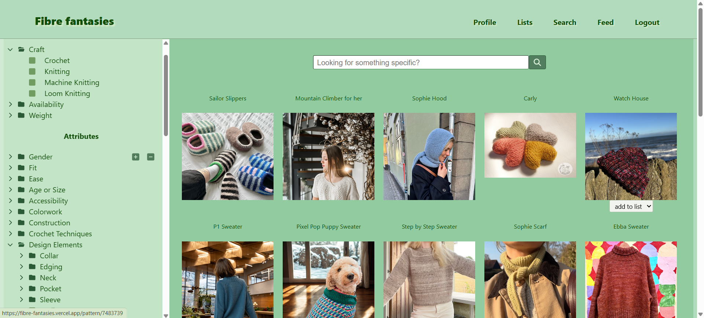
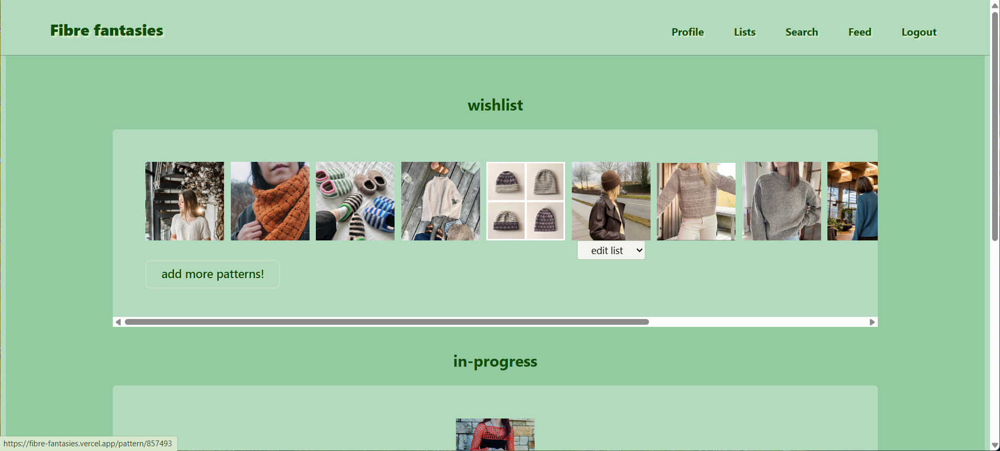
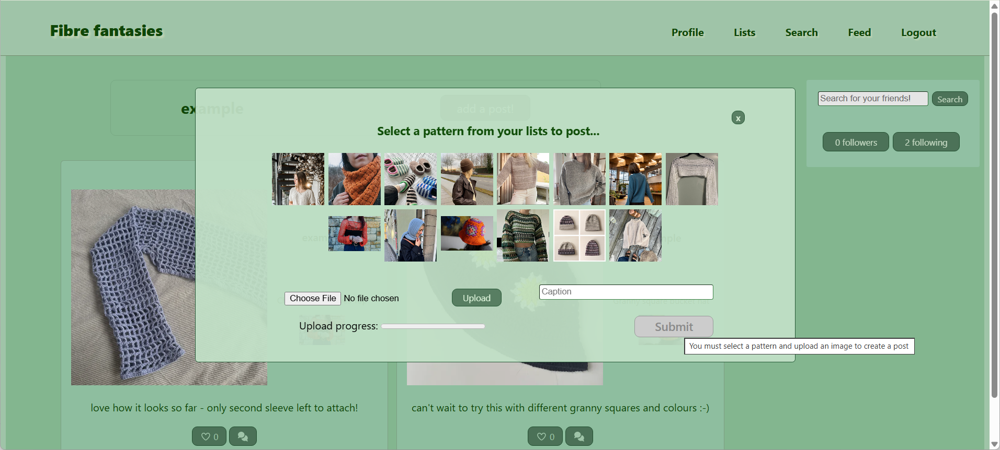
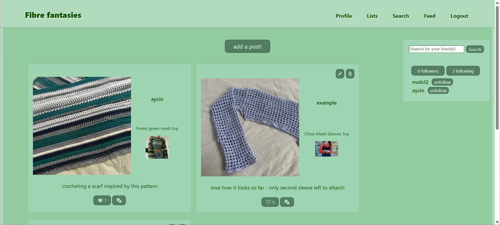
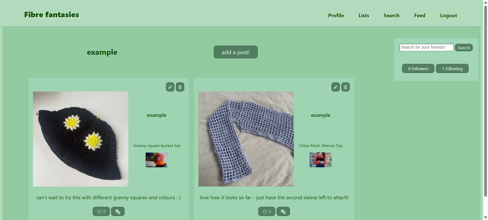
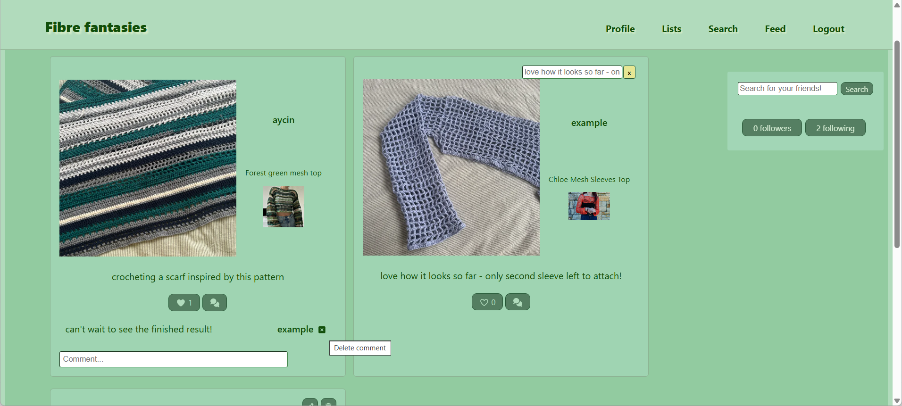
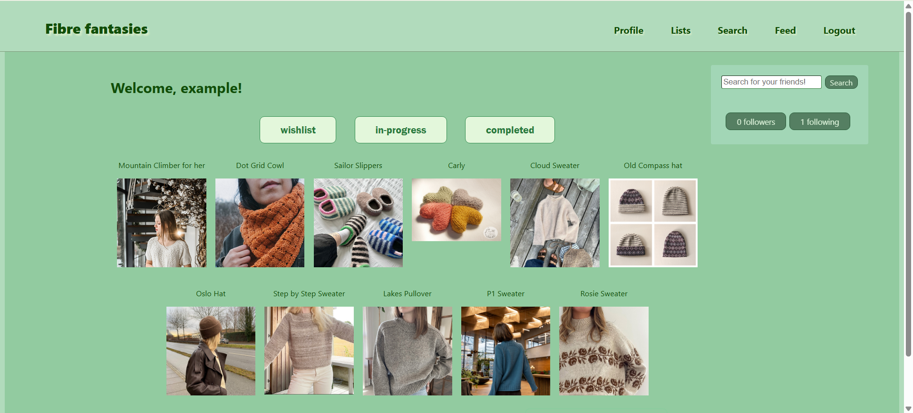
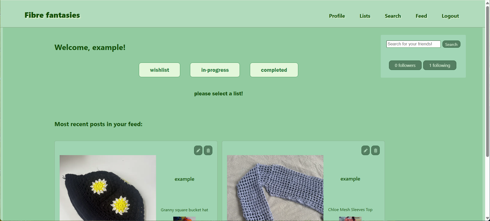

# Fibre fantasies frontend

This project is a full-stack social media platform centered around one of my hobbies: crochet and knitting. It allows users to search for patterns (provided by the [Ravelry API](https://www.ravelry.com/api)), save them to a list, and share posts showcasing their own work. Users can follow one another, interact with posts, and discover and organise patterns.

### Links

[Deployed website](https://fibre-fantasies.vercel.app/)
(The deployed backend takes some time to start up after inactivity so initial delays are expected)

[Deployed API](https://fibre-fantasies-backend.onrender.com)

[Backend code](https://github.com/aycin1/fibre-fantasies-backend)

## How it's made

The frontend is built with **React** and **Vite**, which provides fast development builds. Navigation is achieved using **React-Router** and the interface is composed of reusable components that communicate with the backend using RESTful API calls for CRUD operations.

This project utilises **ImageKit**, which provides optimised image rendering. Images uploaded by users are returned as ImageKit URLs (from the backend) and are subsequently rendered on the frontend.

Styling is achieved with **CSS modules**, enabling local scopes and therefore greater code maintainability.

Tests are run with **Vitest**, using **React Testing Library** for interacting with and querying DOM elements and **Mock Service Worker** to intercept and mock network requests made to the backend.

The frontend is deployed with **Vercel** and the backend and database have been deployed on **Render**.

# Usage

Upon visiting the website, users will be prompted to log in or register if they have not already been authenticated.

Once authentication is complete, users are redirected to the homepage, which contains a dashboard of three lists users can add patterns to. Clicking any of these buttons will provide a link to the search page (whether it is populated or not). Users can also search for other users and view users they follow/are followed by in the Homepage, Feed, and Profile.

The search page will initially render an array of patterns returned by the third-party API (Ravelry). Users can refine their search by selecting any of the options in the sidebar, which automatically updates the results, and by utilising the search bar for specific queries. The search page currently returns the first 30 results, although I intend to implement pagination.  
Hovering over any pattern image will reveal a dropdown menu that allows users to add the pattern to a list (or change the list/remove if pattern has previously been added to a list). Clicking the pattern image redirects the user to the pattern page. These features are available anywhere the pattern image is seen, except during the process of creating a post.

The pattern page contains relevant information on what users may need to recreate the item - as well as a link to the source where users can purchase or download the pattern.

Users can view the contents of all of their lists on the lists page. There will eventually be an option to create/delete custom lists as desired.

Creating a post is achievable via the Profile and Feed pages, where users must select a pattern and upload an image, and can optionally add a caption.

The feed contains posts created by the user and everyone they follow, with the most recent displayed first.

The profile contains posts created by the user, with the most recent displayed first.

Users are able to edit the captions of or delete their own posts, as well as interact with posts. These features are available anywhere posts are visible (Profile, Feed, and Home).

- For revisiting users, selecting a populated list will render them as such:
  

- Furthermore, for revisiting users who are following others that have posted (or have posted themselves), the most recent two posts are visible on the homepage upon authentication.
  

## Dependencies

- @fortawesome/fontawesome-svg-core 7.0.1
- @fortawesome/free-regular-svg-icons 7.1.0
- @fortawesome/free-solid-svg-icons 7.0.1
- @fortawesome/react-fontawesome 3.0.2
- @imagekit/react 5.0.1
- axios 1.12.1
- react 19.1.1
- react-checkbox-tree 1.8.0
- react-dom 19.1.1
- react-router 7.9.0
- uuid 13.0.0

# Improvements

- I intend to implement pagination within the Search component for faster loading of data on the frontend received from the third party API via the backend.

- Currently, three default lists are created upon user registration on the backend. I would like to establish the appropriate endpoints for users to be able to create, edit the name of, and delete their own lists.

- I would like to add some more features for the social aspect of the website, such as the ability to reply to comments, notifications for the latest post interactions and follows, and instant messaging between users, where they can share posts or patterns with each other.

- I aim to add privacy features such as making your profile private and having the ability to approve or deny follow requests from other users, as well as the option to make any list public and therefore visible on the users profile.

- Furthermore, I hope to collate informative blogs and tutorials for an educational section for those who would like to learn or advance their skills.

# Acknowledgements

- [Ravelry](https://www.ravelry.com/api)

- [Dave Gray](https://github.com/gitdagray)

- [Font Awesome](https://fontawesome.com/)

- [ImageKit](https://imagekit.io/)

## Disclaimer

This project is purely for the purpose of presenting the skills I have obtained from building my own full-stack site
