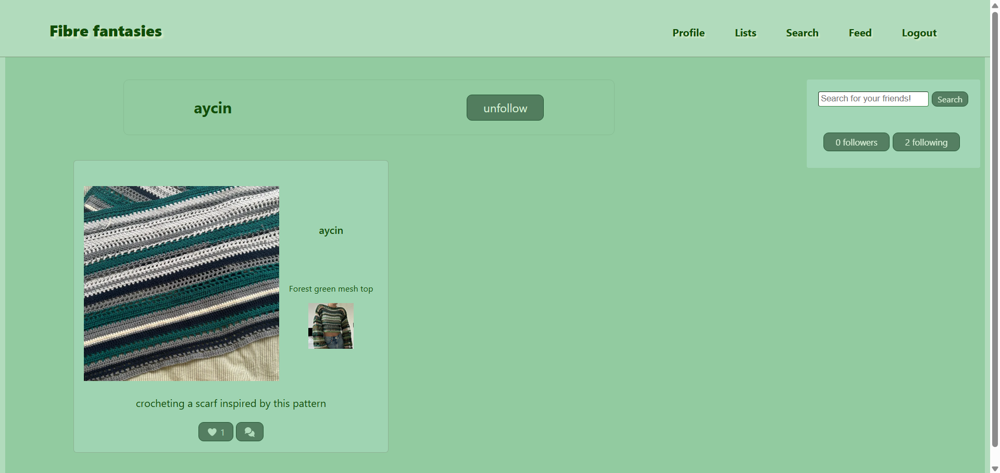

# Fibre Fantasies - Frontend

This project is a full-stack social media platform for crochet and knitting enthusiasts. Users can browse and search patterns (via the [Ravelry API](https://www.ravelry.com/api)), save them to lists, create posts showcasing their creations, follow other users, and interact with posts through likes and comments. The frontend communicates with a Node.js/Express backend that handles authentication, post management, lists, and all database operations.

This project was built to demonstrate my full-stack engineering skills while creating something connected to one of my hobbies.

<details open>
  <summary><h3>Table of Contents</h3></summary>
  <ol>
    <li><a href="#links">Links</a></li>
    <li><a href="#features">Features</a></li>
    <li><a href="#tech-stack">Tech Stack</a></li>
    <li><a href="#usage">Usage</a></li>
    <li><a href="#running-locally">Running Locally</a></li>
    <li><a href="#how-its-made">How It's Made</a></li>
    <li><a href="#dependencies">Dependencies</a></li>
    <li><a href="#future-improvements">Future Improvements</a></li>
    <li><a href="#acknowledgements">Acknowledgements</a></li>
  </ol>
</details>

## Links

- [Deployed website](https://fibre-fantasies.vercel.app/)
  (Note: the Render free tier may take up to a minute to wake the API after inactivity)
- [Deployed API](https://fibre-fantasies-backend.onrender.com)
- [Backend repository](https://github.com/aycin1/fibre-fantasies-backend)

## Features

- User authentication (register, login, persistent sessions)
- Pattern search powered by the **Ravelry API**
- Save patterns to default lists
- Create posts with image uploads via **ImageKit**
- Social features: follow/unfollow, likes, comments, personalised feed
- Profile pages for both the logged-in user and others
- Fully responsive design
- Testing with **Vitest**, **React Testing Library**, and **Mock Service Worker**

## Tech Stack

### Frontend

- React and Vite
- React-Router
- CSS Modules
- Axios
- ImageKit

### Backend

- Node.js / Express
- PostgreSQL
- pg
- JWT authentication
- ImageKit
- Ravelry API

### Testing

- Vitest
- React Testing Library
- Mock Service Worker

### Deployment

- Vercel (frontend)
- Render (backend and database)

<details>

<summary><h2>Usage</h2></summary>

### Authentication

Upon visiting the website, users will be prompted to log in or register.


### Homepage


Users can search for other users and view users they follow/are followed by in the Home, Feed, and Profile pages.

Selecting a populated list will render them as such:


Furthermore, for users with a populated feed, a snippet of their feed is displayed:


### Pattern Search

The search page will initially render an array of patterns from the Ravelry API. Users can use the search bar for specific queries, and filtering is handled through a sidebar with dynamic updates.  

Hovering over a pattern will reveal a dropdown menu that allows users to add the pattern to a list (or change the list/remove if pattern has previously been added to a list). Clicking the pattern image redirects the user to the pattern page. These features are available anywhere the pattern image is seen, except during the process of creating a post.

### Pattern Page

Contains relevant information on what users may need to recreate the item - as well as a link to the original source where users can purchase or download the pattern.


### Lists

Displays all lists and their contents.


### Creating Posts

Creating a post is achievable via the Profile and Feed pages, where users must select a pattern and upload an image, and can optionally add a caption.


### Feed

Displays posts created by the user and users they follow.


### Profile

Displays posts created by the user.


### Post interactions

Users are able to edit the captions of or delete their own posts, as well as liking and commenting on all posts. These features are available anywhere posts are visible.


### User Profile

Clicking the username of another user will redirect you to their profile.


</details>

## Running Locally

1. Clone the repository:

```bash
   git clone https://github.com/aycin1/fibre-fantasies-frontend
   cd fibre-fantasies-frontend
```

2. Install dependencies

```bash
   npm install
```

3. Add a `.env` file to the root directory with:

```ini
    VITE_API_URL=https://fibre-fantasies-backend.onrender.com
```

4. Start the development server:

```bash
   npm run dev
```

## How It's Made

The frontend is built as a **React** single-page application using **Vite** for fast development builds and bundling. Navigation is handled with **React-Router**, and all communication with the backend uses RESTful API calls.

### Architecture Highlights

- Follows a client-server architecture with token-based authentication
- **ImageKit** provides secure uploads and optimised CDN delivery
- **CSS modules** ensure locally scoped styles and maintainable components

### Testing

- **Vitest** and **React Testing Library** for component and behaviour testing
- **Mock Service Worker** for API mocking

### Deployment

- The frontend is deployed on **Vercel**
- The backend and database are deployed on **Render**.

## Dependencies

- @fortawesome/fontawesome-svg-core 7.0.1
- @fortawesome/free-regular-svg-icons 7.1.0
- @fortawesome/free-solid-svg-icons 7.0.1
- @fortawesome/react-fontawesome 3.0.2
- @imagekit/react 5.0.1
- axios 1.12.1
- react 19.1.1
- react-checkbox-tree 1.8.0
- react-dom 19.1.1
- react-router 7.9.0
- uuid 13.0.0

## Future Improvements

### Performance & UX

- Pagination for pattern search
- Lazy loading of images

### Enhancements

- Full CRUD for user-created custom lists
- Comment replies
- Notifications
- Direct messaging
- Sharing patterns or posts via messages

### Privacy Features

- Option for private profile
- Public lists visible on profiles

### Content Expansion

- Tutorials
- Blog posts

## Acknowledgements

- [Ravelry](https://www.ravelry.com/api)
- [Dave Gray](https://github.com/gitdagray)
- [Font Awesome](https://fontawesome.com/)
- [ImageKit](https://imagekit.io/)
